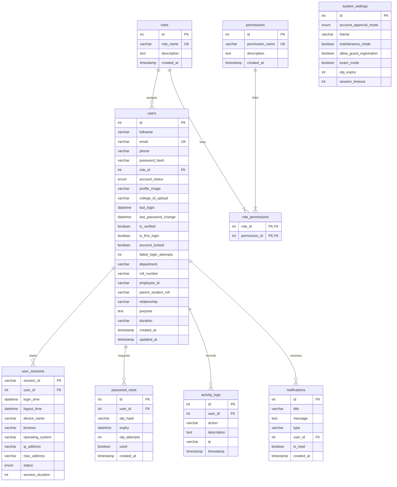
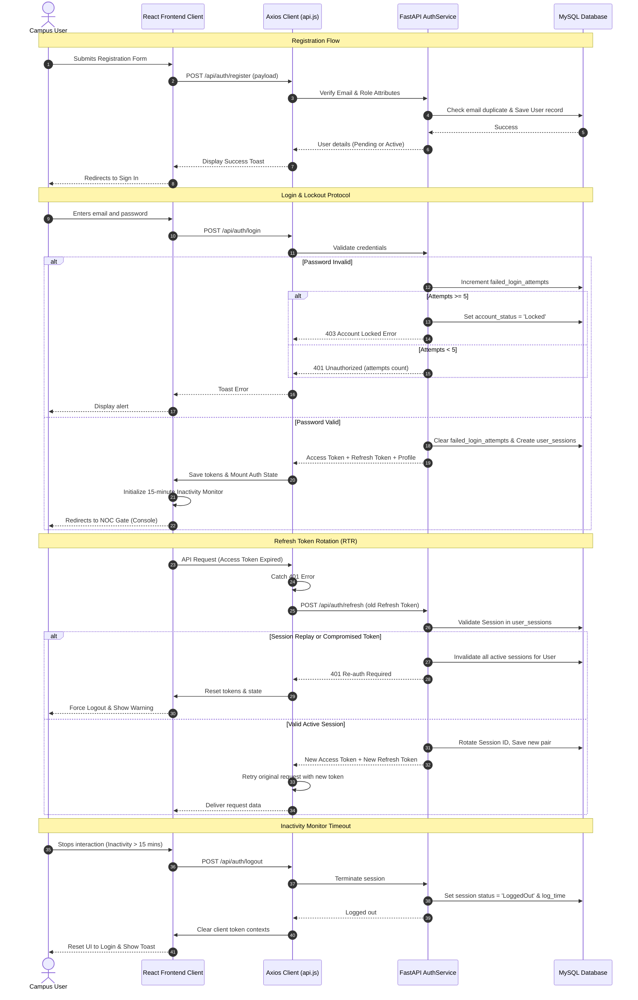

# SecureCampus AI - Stage 1 Architecture Documentation

This document describes the clean architecture design, database relationships (ERD), authentication flows, and sequence diagrams for the Stage 1 Authentication Module of the SecureCampus AI Access System.

---

## 1. Clean Folder Architecture Diagram

The system employs a strict separation of concerns following clean MVC patterns on both the frontend and backend:

```
d:\Juniper\
├── backend/
│   ├── app/
│   │   ├── config/          # Configurations & environment variables loader
│   │   ├── models/          # SQLAlchemy database model entities
│   │   ├── schemas/         # Pydantic input/output schemas
│   │   ├── repositories/    # Database query abstraction layer
│   │   ├── services/        # Central domain business logic layer
│   │   ├── controllers/     # Route controller endpoints (mapped to routers)
│   │   ├── routes/          # FastAPI routers mounting paths
│   │   ├── middleware/      # CORS and session-check handlers
│   │   └── utils/           # Password hashing, JWT creation & OTP helpers
│   ├── tests/               # pytest test cases
│   ├── seed.py              # Superadmin & config database seed runner
│   ├── run.py               # server entry launcher (uvicorn)
│   └── requirements.txt
│
├── frontend/
│   ├── src/
│   │   ├── assets/          # Static graphical resources
│   │   ├── components/      # Reusable styled UI elements (canvas, icons)
│   │   ├── constants/       # central options list (departments, roles)
│   │   ├── contexts/        # Auth and Theme provider states
│   │   ├── hooks/           # useSessionTimeout, useAuth hooks
│   │   ├── layouts/         # Navbar, Footer structures
│   │   ├── pages/           # Pages (Landing, Login, Register, Forgot, Reset)
│   │   ├── services/        # Axios API wrapper client
│   │   ├── styles/          # Tailwind custom index.css style definitions
│   │   ├── utils/           # Input validation expressions & formatting helpers
│   │   ├── App.jsx          # Route configurations
│   │   └── main.jsx         # client mount point
│   ├── tailwind.config.js
│   ├── postcss.config.js
│   └── package.json
│
├── database/
│   ├── schema.sql           # MySQL database schema DDL queries
│   └── init_db.py           # Database setup script
```

---

## 2. Entity-Relationship (ER) Diagram

The database structure incorporates robust tables supporting dynamic settings, login audit logging, notifications, and strict Role-Based Access Control (RBAC):



---

## 3. Authentication & Session Lifetime Sequence Diagram

This sequence traces the request loops from frontend components, through Axios API layers, to the backend service handlers, illustrating lockouts, token rotation, and auto-logout:


